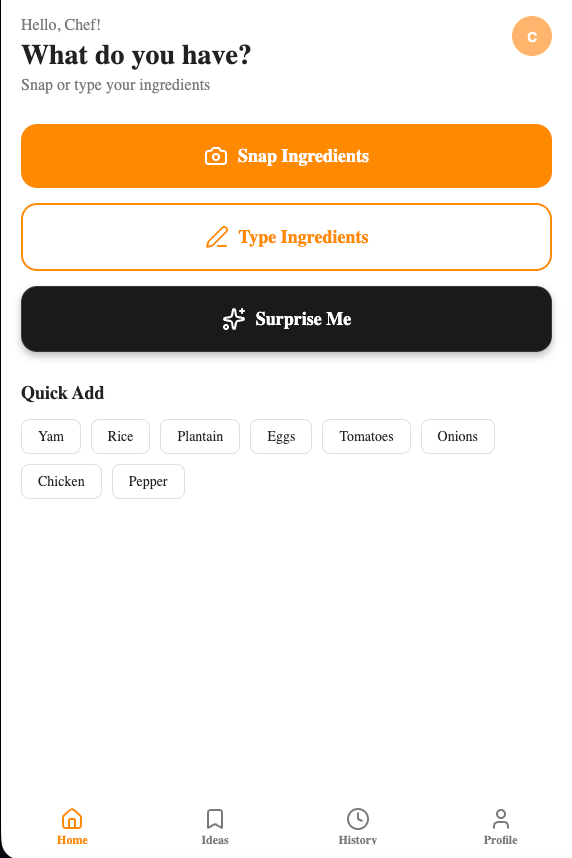
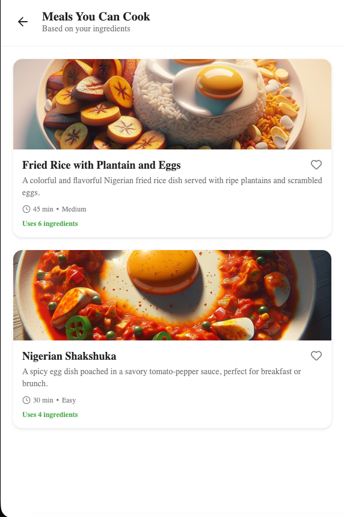
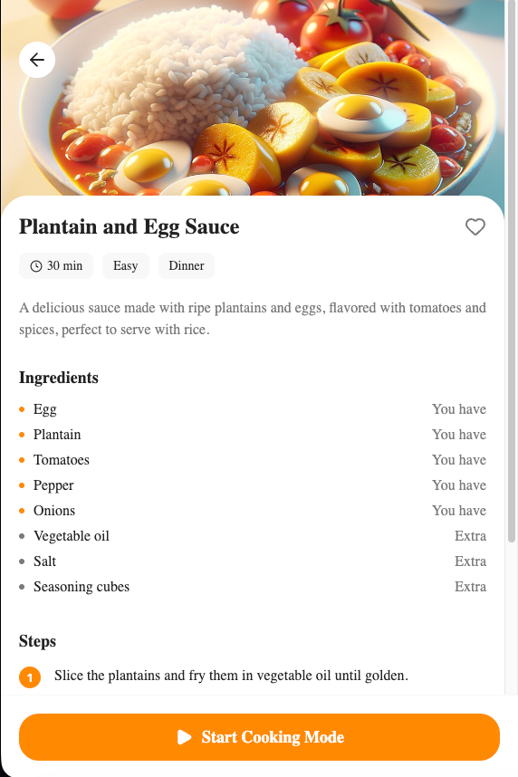
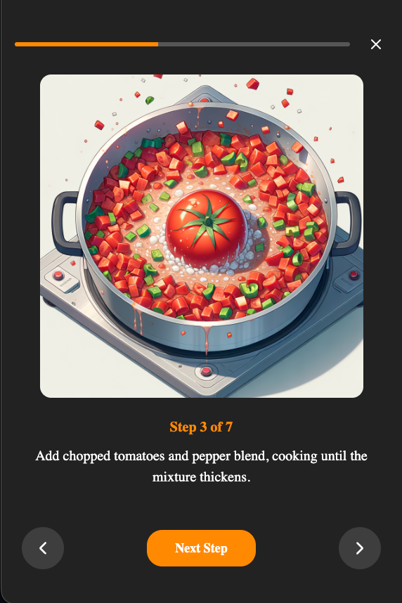

# Chefly 👨🏾‍🍳

Chefly is an intelligent, AI-powered cooking assistant designed to help you cook with confidence. By leveraging advanced AI models, Chefly transforms the ingredients you have at home into delicious, personalized recipes, complete with visual guides.

## 🚀 Features

- **📸 Snap & Cook**: Simply take a photo of your ingredients, and Chefly will identify them instantly.
- **✨ AI Recipe Generation**: Get detailed, step-by-step recipes tailored to your available ingredients, preferences, and cooking time.
- **🎨 Visual Cooking Steps**: Experience cooking like never before with AI-generated, 3D anime-style visualizations for every step of the recipe.
- **🎲 Surprise Me**: Not sure what to eat? Let Chefly generate a random meal idea based on your mood and category preferences (Breakfast, Lunch, Dinner, etc.).
- **📝 Smart Ingredient Input**: Manually type or edit your ingredient list for precise control.

## 📸 Screenshots

  
  
  
  

## 🧠 AI Models & Technology

Chefly is built using cutting-edge Artificial Intelligence to provide a seamless experience:

- **Google Gemini**: Used for **Computer Vision** and **Image Generation**.
  - *Vision*: Analyzes photos to accurately detect and list ingredients.
  - *Generation*: Creates beautiful, stylized images for recipe cards and cooking steps.
- **OpenAI (GPT-4)**: Powers the **Recipe Intelligence**.
  - Generates creative, coherent, and accurate recipes.
  - Understands culinary context to provide helpful tips and substitutions.

## 🛠️ Tech Stack

- **Frontend**: React Native (Expo) for a cross-platform mobile experience (iOS, Android, and Web).
- **Backend**: Python (FastAPI) for a robust and high-performance API.
- **Database**: PostgreSQL (Neon) for reliable data storage.
